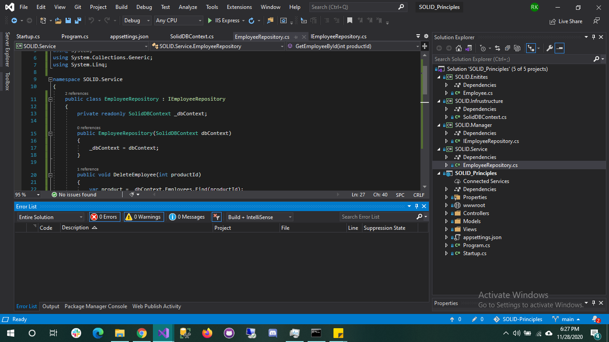

# SOLID-Principals

* SOLID is an acronym of the following:
    * S: Single Responsibility Principle (SRP)
    * O: Open closed Principle (OSP)
    * L: Liskov substitution Principle (LSP)
    * I: Interface Segregation Principle (ISP)
    * D: Dependency Inversion Principle (DIP)

--Structure of the project:
---------------------------

 

 &nbsp;

## Single Responsibility Principle (SRP)

 

 Every class, or Module, in your code should have only one job to do. Suppose "InsetEmployee()" module only work data related task. then if we save or update my context then "Save()" module work.Two module do only one job.
 Another example is for Employee/Department service. Employee related task should have only employee service and Epartment related task should have only department service.
 
 ### Every software module should have only one reason to change ###

&nbsp;

## O: Open/Closed Principle ##

The Open-Closed Principle states that “software entities such as modules, classes, functions, etc. should be open for extension, but closed for modification“.

 The Open for extension means we need to design the software modules/classes in such a way that the new responsibilities or functionalities should be added easily when new requirements come. On the other hand, Closed for modification means, we should not modify the class/module until we find some bugs.

 For examples, Bouns is common for all module. Already have SeniorEmployee(),MidEmployee(). If we need module for Junior, we can easily add JuniorEmployee() with inherit Bonus() module with new requirements. 

&nbsp;

## L: Liskov substitution Principle (LSP) ##

 This principle is simple but very important to understand. Child class should not break parent class’s type definition and behavior. 

<table border="0">
 <tr>
    <td></td>
    <td></td>
 </tr>
</table>

 

## I: Interface Segregation Principle (ISP) ##

The Interface Segregation Principle states that “Clients should not be forced to implement any methods they don’t use. Rather than one fat interface, numerous little interfaces are preferred based on groups of methods with each interface serving one submodule“.

<table border="0">
 <tr>
    <td></td>
    <td></td>
 </tr>
</table>

